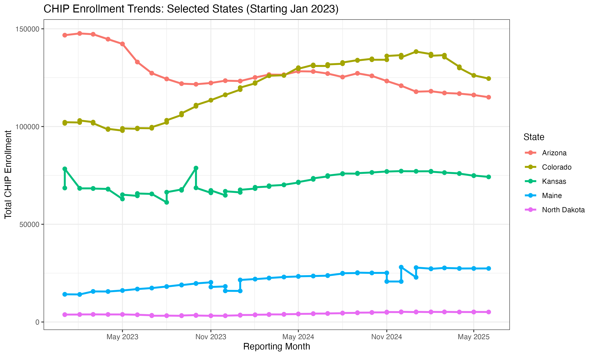

# CHIP Enrollment Expansion Analysis (2023-2025)

## 🏥 Overview
This project analyzes the impact of CHIP eligibility expansion across five states. I used SQL for data extraction and R for time-series visualization.

## 📊 Key Visualization

## 🛠️ Technical Details
* **SQL:** Located in `queries.sql`
* **R Script:** Your script file is also in this folder for review.