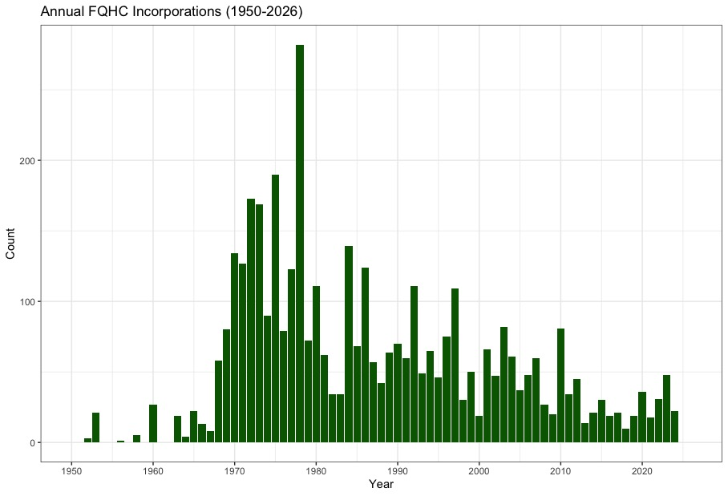
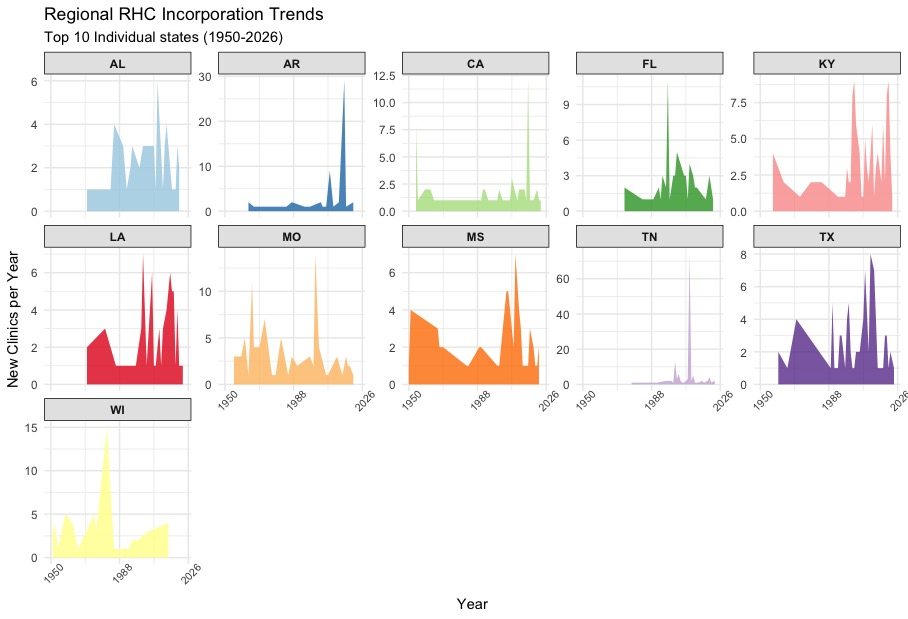
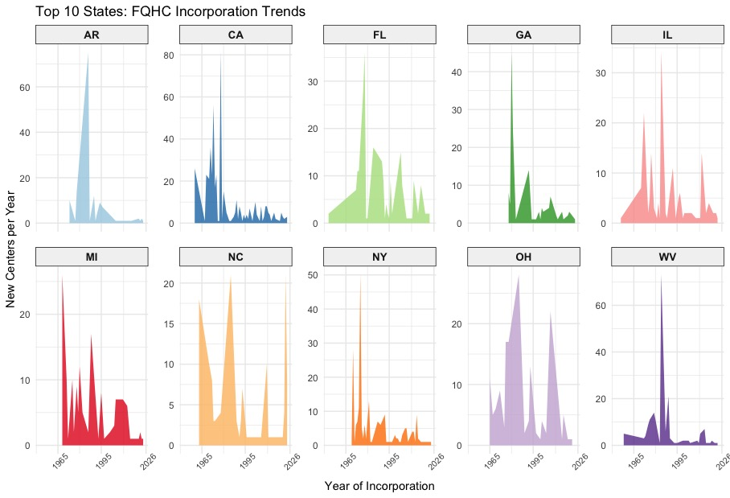

# Rural Health Transformation Program (RHTP) Analysis

This [blog post](https://dragontreecomms.com/a-new-bid-to-improve-rural-health) analyzes the current landscape of rural healthcare infrastructure in the U.S. in light of the $50 billion Rural Health Transformation Program (RHTP) initiative. It explores the distribution, historical growth, and state-level variations of Rural Health Clinics (RHCs) and Federally Qualified Health Centers (FQHCs).

## Table of Contents
* [Problem Statement](#-problem-statement)
* [Data Sources](#-data-sources)
* [SQL Implementation](#-sql-implementation)
* [R Analysis & Visualization](#-r-analysis--visualization)
* [Key Insights](#-key-insights)

---

## ❓ Problem Statement
With $50 billion allocated over five fiscal years (2026–2030), the RHTP aims to fix systemic access issues in rural America. This analysis investigates how existing infrastructure—specifically 5,450+ RHCs and various FQHC "look-alikes"—is positioned to receive these funds, focusing on which states lead in facility density and where historical growth has stagnated.

---

## 📂 Data Sources
* **CMS Data:** Rural Health Clinic and Federally Qualified Health Center enrollment records (1950–2026).
* **HRSA:** Definitions for FQHC "Look-Alikes" and Section 330 grant structures.
* **Dragon Tree Communications:** Research on the RHTP funding breakdown (50% equal distribution vs. 50% CMS "technical" scoring).

---

## 🛠️ SQL Implementation
### Rural Facility Enrollment & Trends
| Project | Key Functions | Code Link |
| :--- | :--- | :--- |
| **Rural Health Analysis** | Aggregations (COUNT by State), Date Filtering (Growth over time), Joins | [SQL Script](./rural_analysis.sql) |

---

## 📊 R Analysis & Visualization
### Historical Incorporation & Growth Outliers
| Project | Libraries Used | Code Link |
| :--- | :--- | :--- |
| **Growth Trend Analysis** | `tidyverse`, `ggplot2` | [R Script](./rural_health_analysis.R) |

---

## 📈 Key Visualizations

### 1. Historical Incorporation Trends (1950-2026)

---

### 2. RHC Top 10 Development Trends

---

### 3. FQHC Top 10 Development Trends

---

## 💡 Key Insights
* **State Leaders:** Kentucky leads the nation in RHCs (409), while California dominates FQHC enrollments. Texas is a consistent top-three performer across both facility types.
* **Historical Spikes:** Identified Tennessee as a massive outlier in RHC expansion during the 1990s and North Carolina as a unique spike for FQHCs post-2000.
* **Funding Stakes:** Analysis highlights the urgency for states to demonstrate "technical need" to secure their share of the discretionary $25 billion RHTP fund.
* **Stagnation:** Data shows that FQHC incorporation peaked in the 1970s–90s and has remained at low levels ever since, suggesting a significant need for the RHTP's "New Bid" to revitalize infrastructure.