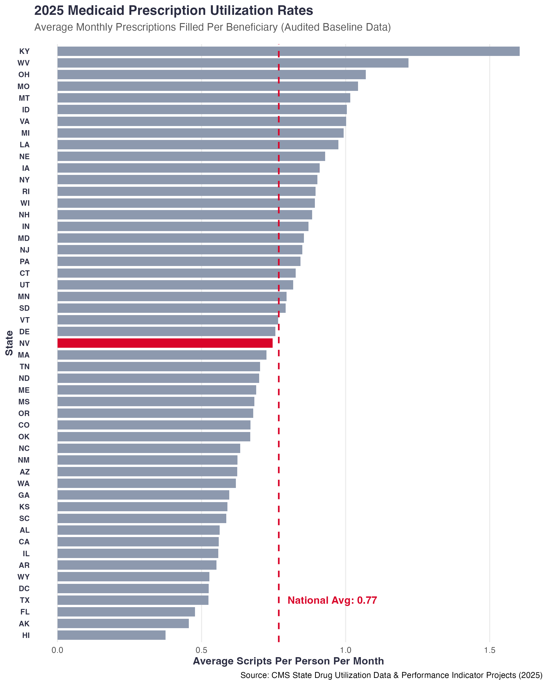

# 2025 Medicaid Prescription Utilization Rates Analysis

This project analyzes variations in Medicaid and CHIP prescription drug utilization across all 50 states for the calendar year 2025. By pairing CMS State Drug Utilization Data (SDUD) with national enrollment figures, this analysis establishes an audited baseline to identify geographical outliers and locate the national median benchmark state (spoiler alert: it's Nevada).

## Table of Contents
* [Problem Statement](#-problem-statement)
* [Data Sources](#-data-sources)
* [SQL Implementation](#sql-implementation)
* [R Analysis & Visualization](#r-analysis--visualization)
* [Key Visualizations](#-key-visualizations)
* [Key Insights](#-key-insights)

---

## ❓ Problem Statement
Public health spending and procurement habits vary drastically by state jurisdiction. This analysis engineers a standardized metric (*Average Monthly Prescriptions Filled Per Beneficiary*) to evaluate state-level utilization deviations and identify which state represents the true mathematical median of the nation.

---

## 📂 Data Sources
* **CMS SDUD:** [Medicaid State Drug Utilization Data (Audited 2025 Full Release)](https://data.medicaid.gov/dataset/158a1baa-5506-400a-8ec3-97756f0b0536)
* **CMS Enrollment:** [State Medicaid and CHIP Applications, Monthly Reports (Updated through April 2026)](https://data.medicaid.gov/dataset/6165f45b-ca93-5bb5-9d06-db29c692a360)

---

## 🛠️ SQL Implementation
### Relational Table Joins & Aggregations
| Focus | Key Functions / Operations | Code Link |
| :--- | :--- | :--- |
| **Data Engineering** | Multi-table Common Table Expressions (CTEs), `INNER JOIN`, `ROW_NUMBER() OVER()`, `ABS()` Distance Metrics | [SQL Script](./medicaid_analysis.sql) |

---

## 📊 R Analysis & Visualization
### Baseline Visualizations
| Analysis | Libraries Used | Code Link |
| :--- | :--- | :--- |
| **Utilization Rates** | `tidyverse`, `ggplot2`, `dplyr` | [R Script](./medicaid_visualization.R) |

---

## 📈 Key Visualizations

### 1. 2025 National Medicaid Prescription Utilization
This ranked horizontal bar chart benchmarks all 50 states against the calculated national average, isolating Nevada as the absolute national median baseline.

---

## 💡 Key Insights
* **The National Median:** Through an absolute rank-distance matrix evaluating both total enrollment and prescription rates, **Nevada (NV)** was isolated as the primary national benchmark state.
* **Data Integrity:** Filtering exclusively for records where `Suppression_Used = 'FALSE'` and `Final_Report = 'Y'` ensures that all visualized points reflect audited, non-skewed baseline values.