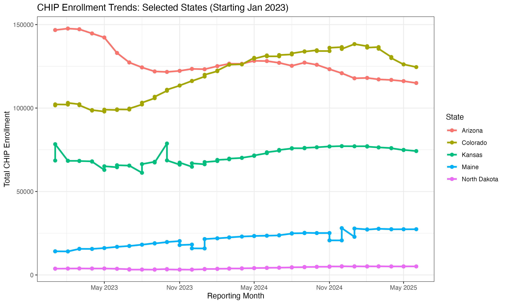

# Chris Hobson's Healthcare Data Analysis Portfolio

Welcome to Chris' Healthcare Data Analysis Portfolio. This is where I will collect all of my data analysis projects related to healthcare.

## Table of Contents
* [Projects](#-featured-healthcare-projects)
* [SQL Implementations](#-sql-projects)
* [R & Data Visualization](#-r-projects)
* [Tableau Dashboards](#-tableau-dashboards)
* [Chris' Guides](#-chris-guides)

---

## 🚀 Featured Healthcare Projects
| Project | Summary | Folder Link |
| :--- | :--- | :--- |
| **Rural Health Transformation** | **[NEW]** Analysis of the Rural Health Transformation Program, focusing on FQHC accessibility and provider ratios. | [View Project Folder](./Project_3_Rural_Healthcare_Centers/) |
| **Hepatitis B Vaccine Guidance** | SQL analysis of Hepatitis B reporting rates and vaccination trends to evaluate the impact of updated CDC guidance. | [View Project Folder](./Project_2_Hepatitis_B_Vaccine_Guidance/) |
| **CHIP Enrollment Analysis** | Investigated enrollment trends across 5 states (2023-2025) following eligibility expansion. | [View Project Folder](./Project_1_CHIP_Enrollment_Expansion_for_Children/README.md) |

---

## 🛠️ Skills & Implementation

### 📁 SQL Projects
| Project | Key Functions | Code Link |
| :--- | :--- | :--- |
| **Rural Health Analysis** | Healthcare Policy Analysis, Historical Community Health Center Trends | [SQL Script](./Project_3_Rural_Healthcare_Centers/rural_analysis.sql) |
| **Hepatitis B Analysis** | Aggregations, State-level Comparison | [SQL Script](./Project_2_Hepatitis_B_Vaccine_Guidance/queries.sql) |
| **CHIP Data Extraction** | Filtering, Joins, Date formatting | [SQL Script](./Project_1_CHIP_Enrollment_Expansion_for_Children/queries.sql) |

### 📊 R Projects
| Project | Libraries Used | Code Link |
| :--- | :--- | :--- |
| **Enrollment Visualization** | `tidyverse`, `ggplot2`, `lubridate` | [R Script](./Project_1_CHIP_Enrollment_Expansion_for_Children/chip_enrollment_analysis.R) |

### 🖼️ Tableau Dashboards
| Dashboard | Description | Status |
| :--- | :--- | :--- |
| **TBD** | Upcoming visualization project. | *In Progress* |

---

## 📈 Key Visualizations
### CHIP Enrollment Trends (2023-2025)

---

## 📚 Chris' Guides
Please check out this list of resources I've used in my projects.
* (Links coming soon)

---

## ⚙️ Technical Details
* **Environment:** VS Code, RStudio, MySQL 9.6.0
* **Version Control:** Git/GitHub
* **Data Sources:** CMS.gov Medicaid/CHIP Monthly Reports, HRSA Data Warehouse